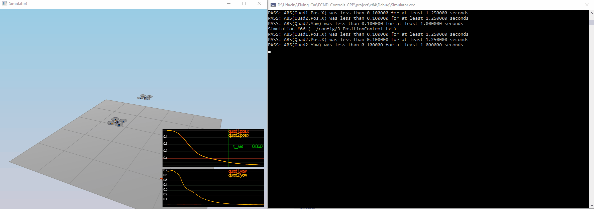

## Project: 3D Control CPP

---
# The Tasks

## [Rubic](https://review.udacity.com/#!/rubrics/1643/view) 
### Body rate and roll/pitch control (Scenario 2)

This scenario requires 
1. Implementation of `GenerateMotorCommands()`.
2. Implementation of `BodyRateControl()`.
3. Tuning `kpPQR`.

`GenerateMotorCommands()`: It requires solving some mathematical equations to compute the desired thrusts on all motors based on the commanded moments and the commands collective thrust.

`BodyRateControl()`: It is a straightforward proportional controller using the moment of inertia of the drone to compute the commanded moments. 

Here is the value of `kpPQR`
```
# Angle rate gains
kpPQR = 100, 100, 12
```


### Position/ Velocity and yaw angle control (Scenario 3)

`LateralPositionControl()`: A proportional controller. The implementation is also straightfoward as it is only a P controller.

`AltitudeControl()`: For this scenario, it is a PD controller. The calculation takes into account the mass of the drone, the gravity acceleration. The constraint of acceleration is also applied. 

Here are the values of `kpPosZ`, `pVelZ`, `kpPosXY`, `kpVelXY`.
```
# Position control gains
kpPosXY = 30
kpPosZ = 80

# Velocity control gains
kpVelXY = 12
kpVelZ = 30
```



### Non-idealities and robustness (Scenario 4)

The `AltitudeControl()` function is updated so that it becomes a PID controller.
Here is the value of Ki value:
```
KiPosZ = 20
```


### Trajectory Follower (Scenario 5)

This scenario shows that the drone is able to better follow the trajectory when the velocity information is also included. 

![Scenario 5(./animations/task_scenario5.gif)

---
